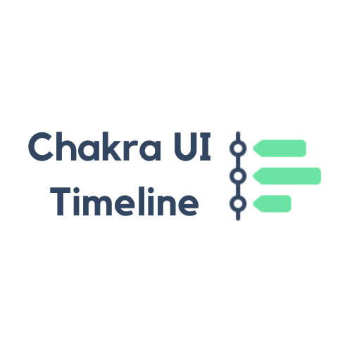

<div align="center">
  <a href="https://github.com/mahdikhashan/99-minutes-emails">
    </a>
  </hr>
</div>

# Chakra UI Timeline 
Component for Chakra UI to show timelines of events


## Demo

[Demo](https://codesandbox.io/s/chakra-timeline-zi5nex)

## Installation

```
npm install --save @mahdikhashan/chakra-timeline
```

## How to use

TODO
## Contributing

Contributions are what make the open source community such an amazing place to be learn, inspire, and create. Any contributions you make are **greatly appreciated**.

1. Fork the Project
2. Create your Feature Branch (`git checkout -b feature/AmazingFeature`)
3. Commit your Changes (`git commit -m 'Add some AmazingFeature'`)
4. Push to the Branch (`git push origin feature/AmazingFeature`)
5. Open a Pull Request

## License

Distributed under the MIT License. See [`LICENSE`](./LICENSE.md) for more information.

## Contributors

Many thanks for your help!

<a href="https://github.com/mahdikhashan/chakra-ui-timeline/graphs/contributors">
  
</a>

The image of contributors is made with [contrib.rocks](https://contrib.rocks).
